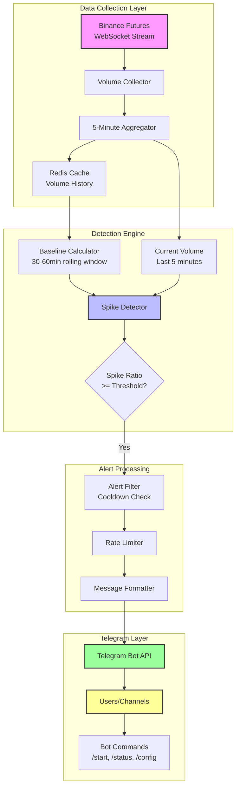
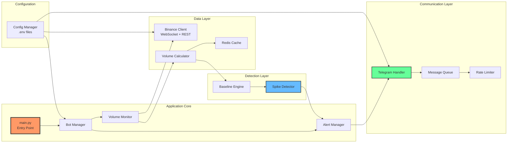
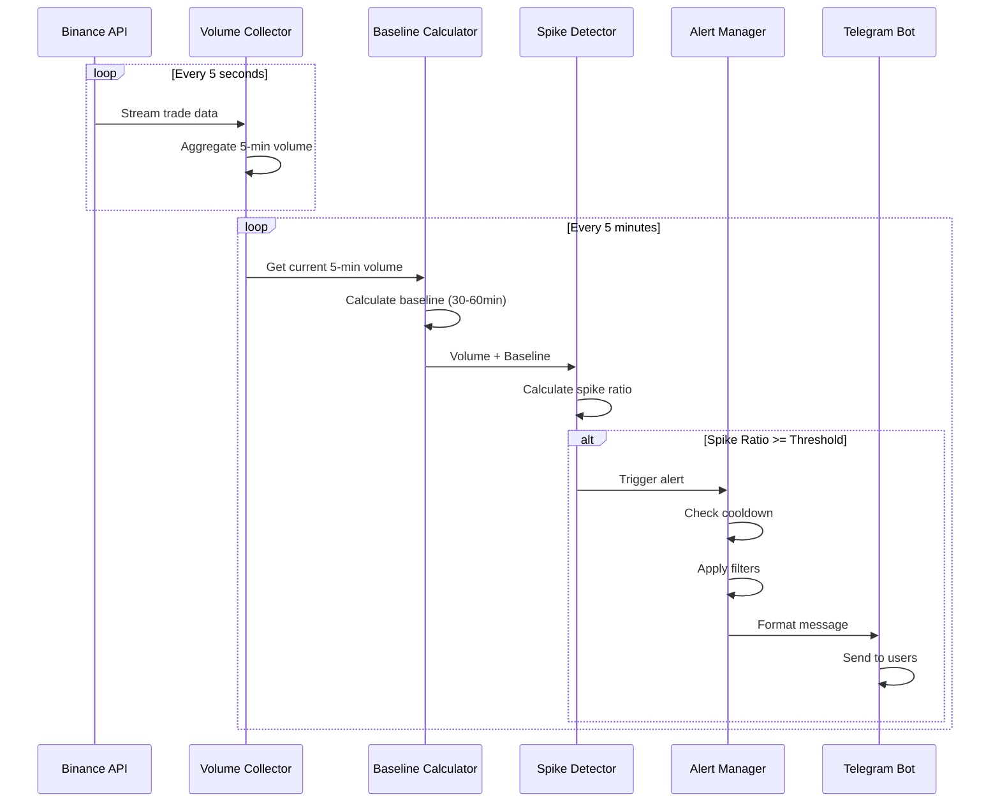
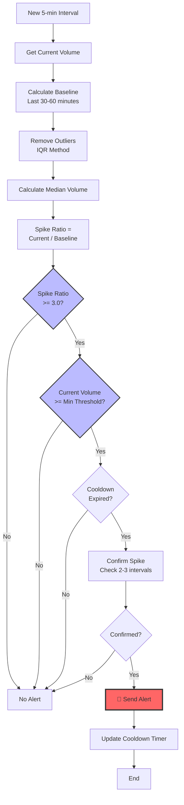
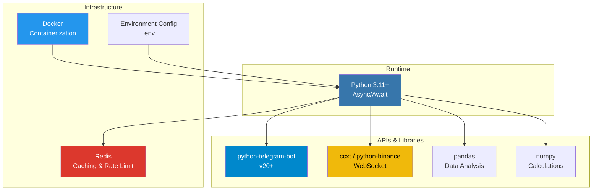
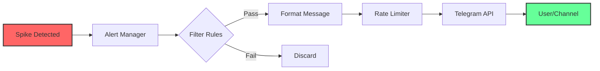

# 🏗️ Volume Alert Bot - System Architecture

## System Flow Diagram



## Component Architecture



## Data Flow Sequence



## Volume Detection Logic



## Technology Stack Visualization



## Alert Message Flow



## Project Structure Tree

```
futu_vol_alert/
│
├── 📁 src/
│   ├── 📁 bot/
│   │   ├── telegram_bot.py      🤖 Bot handler
│   │   └── commands.py          📝 User commands
│   │
│   ├── 📁 data/
│   │   ├── binance_client.py    🔌 API wrapper
│   │   └── volume_calculator.py 📊 Volume math
│   │
│   ├── 📁 detector/
│   │   ├── spike_detector.py     🔍 Spike logic
│   │   └── baseline.py          📈 Baseline calc
│   │
│   ├── 📁 alert/
│   │   ├── alert_manager.py     🚨 Alert engine
│   │   └── formatter.py         ✉️ Message format
│   │
│   └── 📁 utils/
│       ├── config.py            ⚙️ Config loader
│       ├── logger.py            📋 Logging
│       └── cache.py             💾 Redis cache
│
├── 📁 tests/
│   ├── test_detector.py
│   ├── test_volume.py
│   └── test_alerts.py
│
├── 📁 docker/
│   └── Dockerfile
│
├── .env.example
├── requirements.txt
├── README.md
└── main.py                      🚀 Entry point
```

